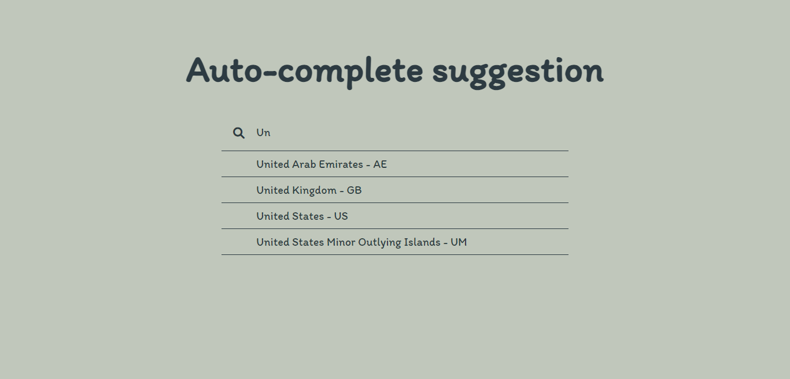
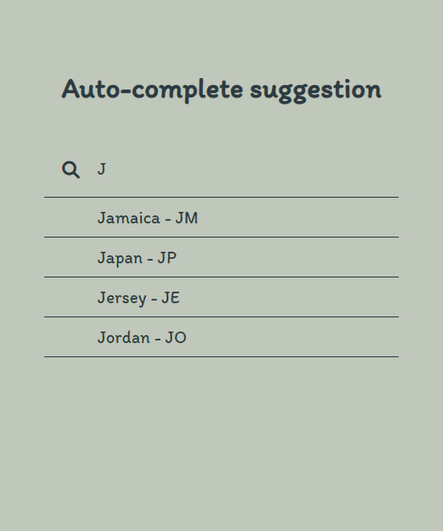

# AUTOCOMPLETE / SUGGESTION

## Overview

  <h3>   Demo - URL link -
    <a href="https://autocomplete-by-sumyat.netlify.app/">
     https://autocomplete-by-sumyat.netlify.app/
    </a>
  </h3>

 
 

 
 

 
 

## Built With

- **HTML**
- **CSS**
- **JS**

## Features

- **Responsive and look great on all devices**
- **Autocomplete/ suggestion app**
- **fetching data from JSON file**
- **Country Name with Code**
